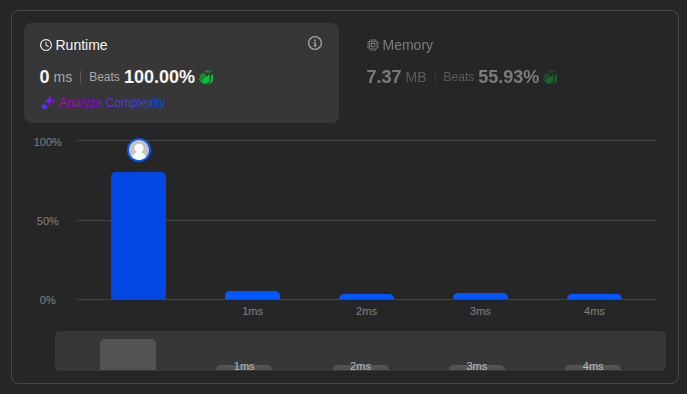
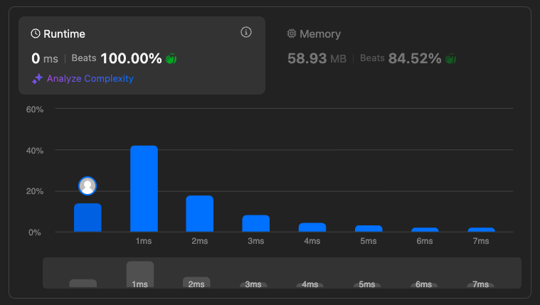

# Solutions

## Approach

Compute each subtree's height and check the balance condition in a single bottom-up depth-first traversal, instead of recomputing height from scratch at every node.

## How It Works

For each node:

1. Recursively compute the height of the left subtree.
2. Recursively compute the height of the right subtree.
3. If either subtree already reported an imbalance (signaled as `-1`), propagate that signal upward immediately.
4. If the height difference between the two subtrees exceeds 1, mark this node as unbalanced (return `-1`).
5. Otherwise, return this node's height: `max(left, right) + 1`.

Once a subtree is found to be unbalanced, the `-1` signal short-circuits the rest of the traversal — no further height calculations are needed for that branch.

## Complexity

- Time: `O(n)` — each node is visited exactly once, computing height and checking balance in the same pass.
- Space: `O(h)` — recursion stack depth equals the tree height `h`; `O(log n)` for a balanced tree, `O(n)` in the worst case (a skewed tree).

## Performance

