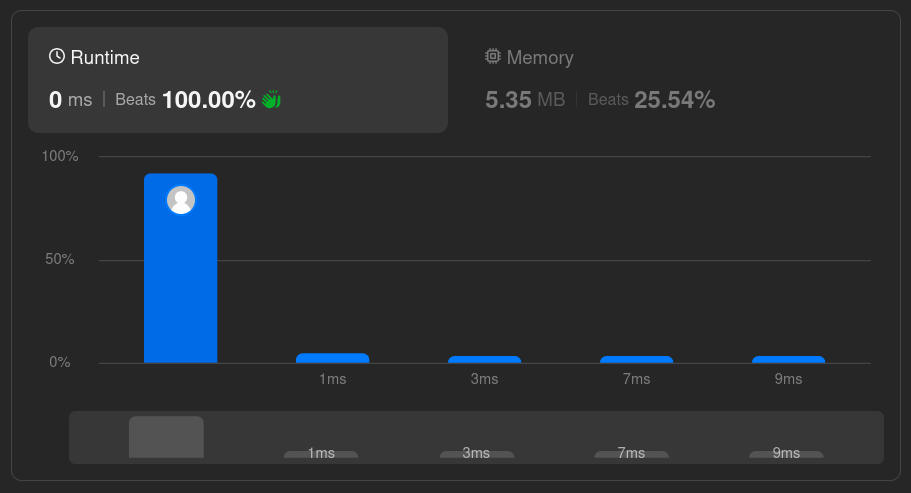

# Solutions

## Approach

Use divide and conquer: pick the middle element as the root, then recursively build the left subtree from the left half of the array and the right subtree from the right half. Always splitting at the midpoint guarantees the resulting tree stays balanced.

## How It Works

1. Find the middle index of the (sub)array.
2. Create a node with that value.
3. Recursively repeat for the left and right subarrays.
4. Stop when the range is empty.

## Complexity

- Time: `O(n)` — each element is used exactly once to create a node.
- Space: `O(log n)` auxiliary (recursion stack), since the tree is balanced and its height is approximately `log n`.

Both implementations build a new subarray/slice at each recursive call (`nums.slice(...)` in JavaScript, slice expressions in Go), which adds allocation overhead beyond the recursion stack. Passing index bounds instead of new arrays would avoid this.

## Performance

