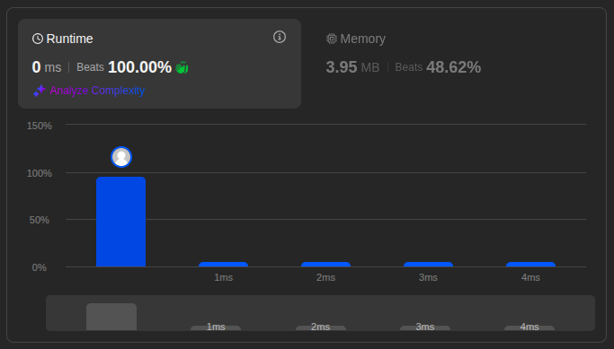

# Solutions

## Approach

The KMP (Knuth-Morris-Pratt) algorithm finds the first occurrence of `needle` in `haystack` in linear time. It preprocesses `needle` into an LPS ("longest prefix suffix") table, then uses that table to skip re-comparing characters that have already been matched.

## How It Works

1. Build the LPS table for `needle`: for each prefix of `needle`, record the length of the longest proper prefix of that prefix which is also a suffix of it.
2. Scan `haystack` and `needle` together with two pointers, `i` and `j`.
3. On a mismatch, instead of restarting `j` at `0`, jump back using `lps[j-1]` — this is what avoids re-checking characters.
4. When `j` reaches the length of `needle`, a match has been found at index `i - j`.

## Complexity

- Time: `O(n + m)`
- Space: `O(m)` — for the LPS table

Where `n` is the length of `haystack` and `m` is the length of `needle`.

## Other Approaches

### Naive

Checks for a match at every starting position in `haystack` by comparing it character-by-character against `needle`.

- Time: `O(n * m)`
- Space: `O(1)`

## Performance

Benchmarks comparing the naive and KMP approaches show KMP scaling significantly better on large or repetitive inputs, since it avoids re-checking characters that have already been matched.

