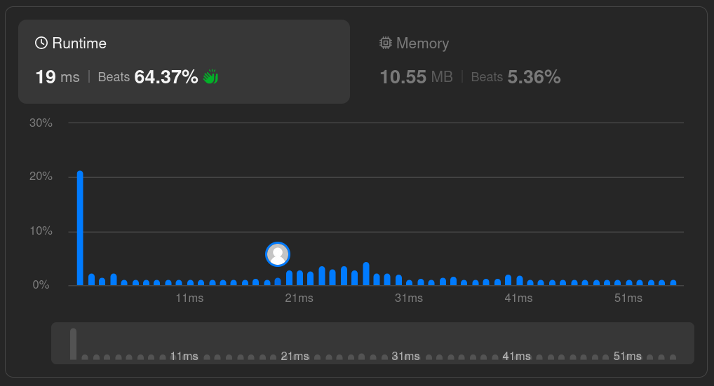
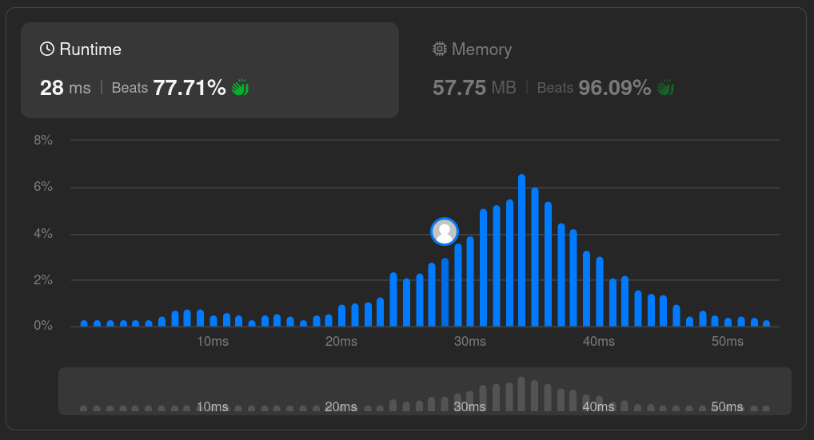

# Solutions

## Approach

Use a two-pass frequency-counting approach: count how many times each character appears using a hash map, then scan again to find the first character whose count is exactly 1. This avoids the O(n²) alternative of checking every character against the rest of the string.

## How It Works

1. First pass: count the frequency of every character into a hash map.
2. Second pass: walk the string in order and return the index of the first character whose count is `1`.
3. If no such character exists, return `-1`.

## Complexity

- Time: `O(n)` — two linear passes over the string.
- Space: `O(1)` — the map holds at most 26 lowercase English letters, a constant bound regardless of input size.

## Performance

