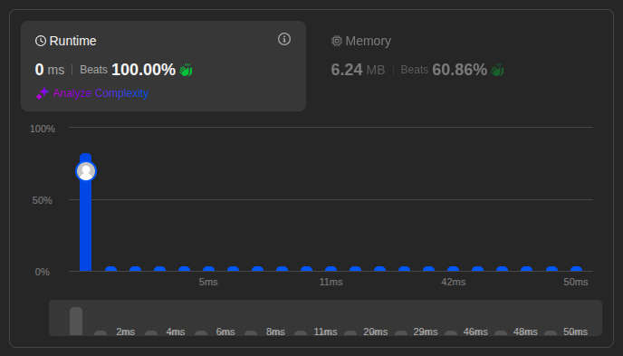

# Solutions

## Approach

Use two pointers moving in the same direction: one tracks the last position of a confirmed unique element, the other scans ahead looking for the next unique value.

## How It Works

1. Initialize a tracking index at `0` — this marks the position of the last unique element written so far.
2. Iterate through the array with a scanning index starting at `1`.
3. Whenever the scanning index finds a value different from the one at the tracking index, move it into the slot right after the tracking index and advance the tracking index.
4. After the loop, `tracking index + 1` is the count of unique elements.

## Complexity

- Time: `O(n)` — each element is visited once.
- Space: `O(1)` — the array is modified in place.

## Performance

