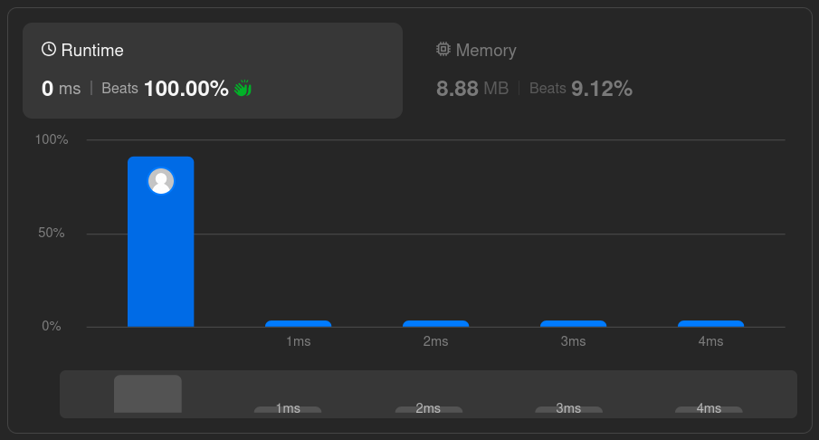

# Solutions

## Approach

Use a two-pointer approach: swap characters from the beginning and end of the array, moving both pointers toward the middle.

## How It Works

1. Set up pointers at the start and end of the slice.
2. Swap the elements at those positions.
3. Move the start pointer forward and the end pointer backward.
4. Repeat until the pointers meet in the middle.

## Complexity

- Time: `O(n)` — the loop runs `n/2` times with constant work per iteration.
- Space: `O(1)` — the array is reversed in place with no extra memory.

## Performance

