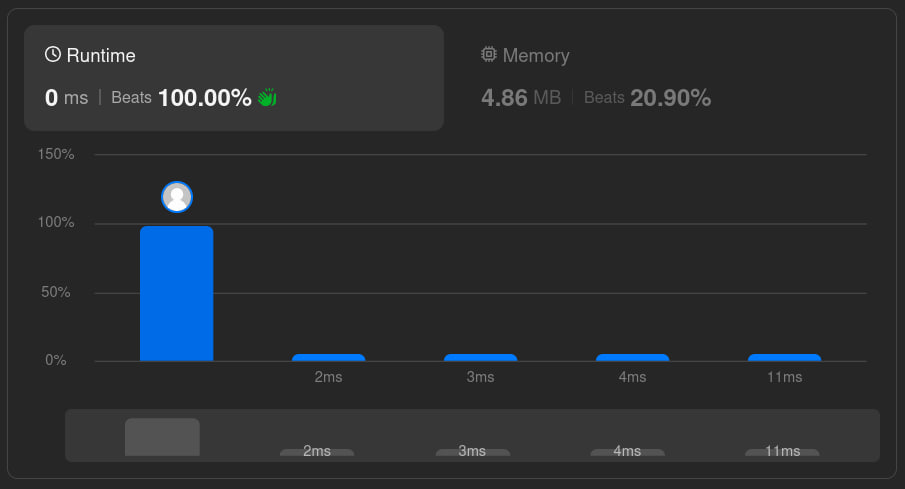
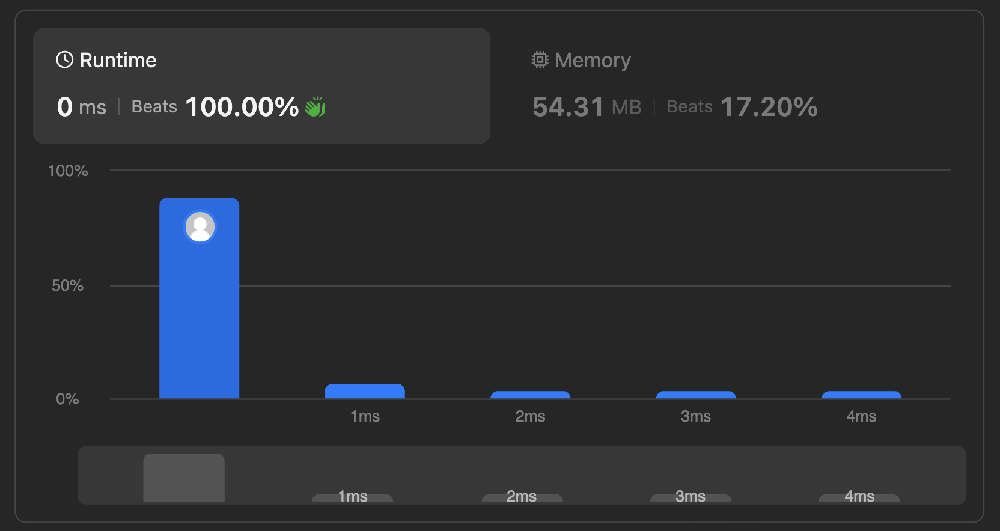

# Solutions

## Approach

Binary search for the leftmost index where `nums[index] >= target`. Narrow the search range until `left` and `right` meet — at that point `left` is the correct insertion index.

## How It Works

1. Initialize `left = 0` and `right = nums.length`.
2. While `left < right`:
   - Compute the middle index.
   - If `nums[mid] < target`, the target must be to the right of `mid`, so set `left = mid + 1`.
   - Otherwise, `mid` could be the insertion position, so set `right = mid`.
3. Return `left`.

```text
left = 0
right = len(nums)
while left < right:
    mid = left + (right - left) // 2
    if nums[mid] < target:
        left = mid + 1
    else:
        right = mid
return left
```

This also handles the edge cases correctly: a target smaller than every element returns `0`; a target equal to an existing element returns its index; a target larger than every element returns `nums.length`.

## Complexity

- Time: `O(log n)` — binary search eliminates about half the remaining search space each iteration.
- Space: `O(1)` — a constant number of variables regardless of input size.

## Other Approaches

### Linear scan

A brute-force alternative would scan `nums` from the start and return the first index where `nums[i] >= target`. Simpler to write, but doesn't meet the required `O(log n)` runtime, so it isn't implemented in this repo — binary search is used instead.

- Time: `O(n)`
- Space: `O(1)`

## Performance



