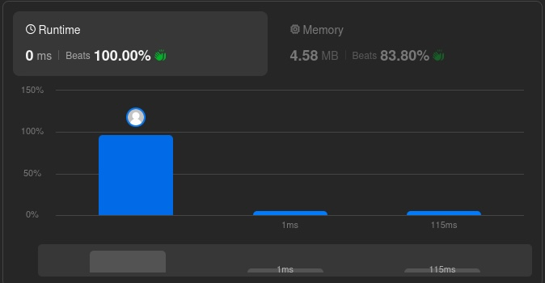
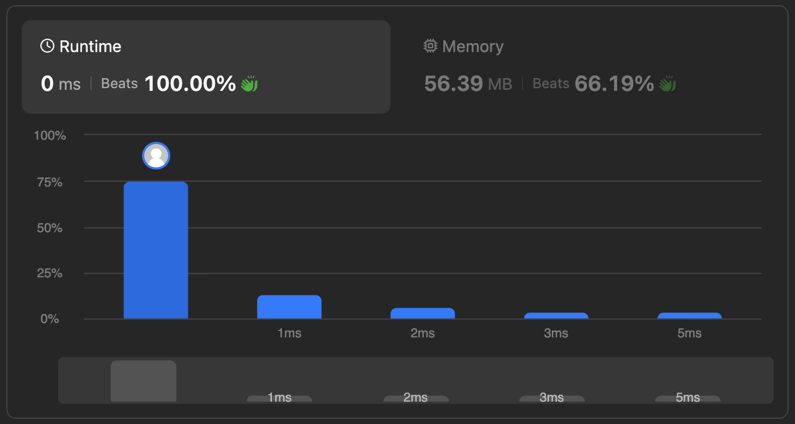

# Solutions

## Approach

Both implementations use recursive depth-first search, but track "is this a left leaf" differently per language.

### JavaScript — parent-aware recursion

At each node, inspect the left child directly to determine whether it's a leaf (both of its own children are `null`). If so, add its value to the result of recursing into the right subtree; otherwise recurse into both subtrees independently. This puts the leaf-detection responsibility on the parent, avoiding the need to pass extra state down the call stack.

### Go — `isLeft` flag propagation

A helper `dfs(node, isLeft)` propagates a boolean flag indicating whether the current node was reached as a left child. When a leaf is reached with `isLeft == true`, its value is returned; otherwise the recursion continues into both children, passing `true` for the left branch and `false` for the right.

## How It Works

Both approaches visit every node exactly once and share the same base cases: an empty subtree contributes `0`, and a leaf that isn't a left child contributes `0`. They differ only in how the "left child" context is tracked — the parent inspecting its child directly (JavaScript) versus a flag threaded through the recursion (Go).

## Complexity

- Time: `O(n)` — every node is visited once.
- Space: `O(h)` — recursion stack depth equals the tree height `h`.

## Comparison

| Approach | Language | Left-context tracking |
|---|---|---|
| Parent-aware recursion | JavaScript | Parent inspects its left child |
| `isLeft` flag propagation | Go | Flag passed down the call stack |

## Performance

