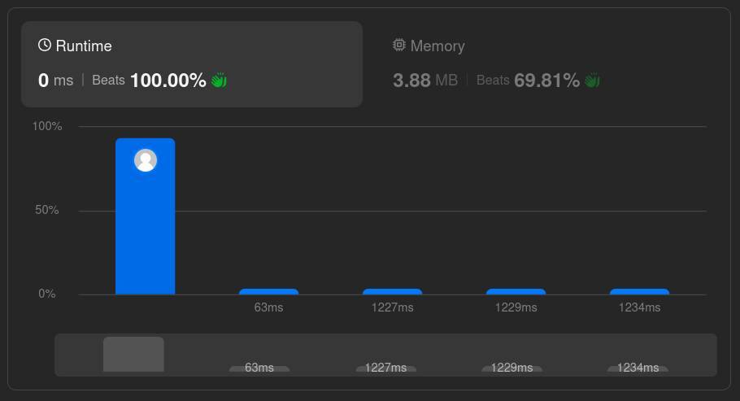
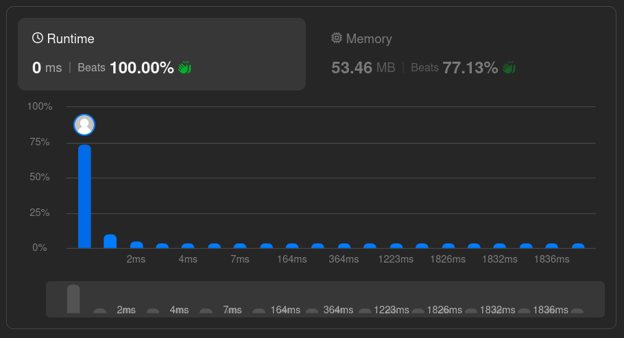

# Solutions

## Approach

Two techniques are implemented in Go — binary search and Newton's method — while the JavaScript solution uses a recursive binary search.

### Go — binary search (`main.go`)

Searches for a value `mid` such that `mid * mid == num`, narrowing the range by comparing `mid * mid` to `num` at each step.

### Go — Newton's method (`main_newton.go`)

Approximates the square root using the update rule `x = (x + num/x) / 2`, starting from `x = num` and iterating until `x` converges. A final check (`x*x == num`) confirms whether the result is an exact perfect square.

### JavaScript — recursive binary search (`main.js`)

Recursively searches the range `[2, num/2]` for a `middle` value such that `middle * middle == num`, narrowing the range based on whether `middle * middle` is above or below `num`. Values less than `2` (`0` and `1`) are treated as perfect squares directly.

## How It Works

All three implementations test the same thing — does some integer, when squared, equal `num`? They differ in how they narrow down that integer: binary search halves the search range using numeric comparison, while Newton's method uses the average-based update rule above, which typically converges in fewer iterations.

## Complexity

- Go binary search — Time: `O(log n)`, Space: `O(1)`
- Go Newton's method — Time: `O(log n)` (faster in practice, usually under 10 iterations), Space: `O(1)`
- JavaScript recursive binary search — Time: `O(log n)`, Space: `O(log n)` (recursion stack)

## Known Limitations (Go binary search)

The Go binary search implementation (`main.go`) has a few rough edges worth noting if revisiting this code:

- The loop condition `start < mid` combined with `start = mid` / `end = mid` (rather than `mid ± 1`) risks an infinite loop for some inputs.
- `mid * mid` can overflow for large `num` near the upper constraint bound.
- `num == 0` is not explicitly handled (only `num == 1` is special-cased).

The Newton's method implementation avoids the overflow risk by comparing `x` to `num/x` instead of squaring directly, and handles `num < 2` up front.

## Performance

